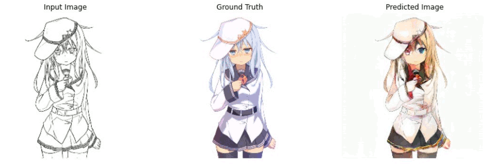
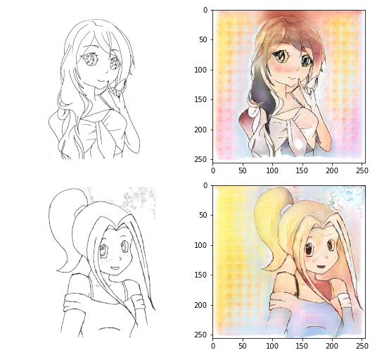

# Sketch to Image | Conditional GAN Implementation

This repository contains my implementation of a **pix2pix** architecture (Conditional GAN) designed to automatically colorize hand-drawn anime sketches. By leveraging the power of adversarial training, the model learns the mapping from grayscale edge maps to vibrant, multi-colored illustrations.

## 🚀 Project Overview
This project is based on the research paper [Image-to-Image Translation with Conditional Adversarial Networks](https://arxiv.org/abs/1611.07004). Unlike standard GANs, this model uses a "condition" (the sketch) to guide the generation process.

### Training Details
* **Dataset:** [Anime Sketch-Colorization Pair](https://www.kaggle.com/ktaebum/anime-sketch-colorization-pair) (14.2k image pairs).
* **Hardware:** Trained on a GTX 1060 6GB.
* **Duration:** ~23 hours for 150 epochs.
* **Architecture:** U-Net Generator + PatchGAN Discriminator.



---

## 🛠 Tech Stack
* **Framework:** TensorFlow 2.2+ / Keras
* **Language:** Python 3.8+
* **Environment:** CUDA-enabled GPU (Highly Recommended)

---

## 📂 Getting Started

### 1. Setup & Installation
Clone the repository and install the necessary dependencies:
```bash
git clone https://github.com/ujwalkirsan/sketch_2_Image.git
cd sketch_2_Image
pip install -r requirements.txt
```

### 2. Dataset Configuration
Download the dataset from Kaggle and update the path in `runModel.py`:
```python
# Line 12 in runModel.py
PATH = 'C:/Your/Path/To/Dataset/'
```

### 3. Execution
To start the training or inference pipeline, run:
```bash
python runModel.py
```

> **Note on Memory:** If you encounter `ResourceExhaustedError` (OOM), reduce the `BATCH_SIZE` in the configuration section (lines 15-19).

---

## 📈 Results & Observations
The model performs best on sketches with clean, white backgrounds. During testing with hand-drawn sketches, the GAN effectively identifies hair, skin, and clothing boundaries to apply consistent shading.

| Input Sketch | Generated Color |
| :--- | :--- |
|  | (See assets for full comparison) |

---

## 🔮 Roadmap
- [ ] **Multi-Style Support:** Train on different art styles (Western vs. Manga).
- [ ] **Video Processing:** Implement frame-by-frame colorization for short animations.
- [ ] **Web Deployment:** Convert the `.h5` model to `TensorFlow.js` for browser-based testing.

---

## 📜 References & Acknowledgments
* **Pix2Pix Paper:** Isola et al., "Image-to-Image Translation with Conditional Adversarial Networks."
* **Original GAN Paper:** Goodfellow et al. (2014).
* Inspiration drawn from official TensorFlow generative tutorials.

---

### Contact & Feedback
If you have ideas for optimization or find any bugs, feel free to open an **Issue** or reach out via my GitHub profile.

**License:** Distributed under the MIT License. See `LICENSE` for more information.